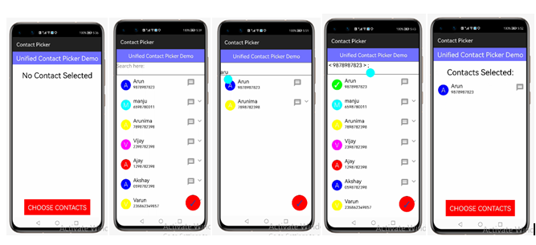

# Unified Contact Picker HOS Library

[](https://github.com/applibgroup/UnifiedContactPicker/actions/workflows/main.yml)
[](https://sonarcloud.io/dashboard?id=applibgroup_UnifiedContactPicker2)

## Introduction

This library unifies the user contacts in a compact and user intuitive way allowing the end-user to choose between the contact's available communication options (email/phone number) follows Material Design guidelines.

Although there is a standard way to call the contact list in Android, it does not always feel well-integrated in your app
HOS applications.
UnifiedContactPicker is an HOS library which allows you to easily integrate contact picking workflow into your application with minimal effort

# Source

The code in this repository was inspired from  https://github.com/quiin/UnifiedContactPicker. We are very thankful to quiin.

## Demo


&nbsp;&nbsp;&nbsp;&nbsp;&nbsp;&nbsp;&nbsp;&nbsp;&nbsp;&nbsp;&nbsp;&nbsp;&nbsp;&nbsp;&nbsp;&nbsp;


## Features

* Unifies user's contacts
* Customizable UI
* Easy and redy to use
* Display list of contacts
* Follows Material Design guidelines

## Installation

In order to use the library, add the following line to your **root** gradle file:

1. For using UnifiedContactPicker module in sample app, include the source code and add the below dependencies in entry/build.gradle to generate hap/support.har.
```
	dependencies {
            implementation project(':unifiedContactPicker')
            implementation fileTree(dir: 'libs', include: ['*.har'])
            testCompile 'junit:junit:4.12'
	}
```
2. For using UnifiedContactPicker in separate application using har file, add the har file in the entry/libs folder and add the dependencies in entry/build.gradle file.
```
	dependencies {
            implementation fileTree(dir: 'libs', include: ['*.har'])
            testCompile 'junit:junit:4.12'
	}

```


# Usage

To use UnifiedContactPicker in your app simply follow this 3 simple steps:

1. Add _read contacts_ && _write contacts_ permission in your config

```
"abilities": [
"reqPermissions":[
          {
            "name":"SystemPermission.READ_CONTACTS",
            "reason":"Populating contacts",
            "usedScene":{
              "ability":[
                "mx.com.quiin.unifiedcontactpicker.ui.ContactPickerAbility","mx.com.quiin.unifiedcontactpicker.MainAbility"
              ],
              "when":"always"
            }
          },
          {
            "name":"SystemPermission.WRITE_CONTACTS",
            "reason":"Populating contacts",
            "usedScene":{
              "ability":[
                "mx.com.quiin.unifiedcontactpicker.ui.ContactPickerAbility","mx.com.quiin.unifiedcontactpicker.MainAbility"
              ],
              "when":"always"
            }
          }
    ]
```

2. Launch _ContactPickerAbility.java_ as activity result

```java
// Your Activity or Fragment
public void launchContactPicker(Button button) {
    button.setClickedListener(listener -> {
        presentForResult(new ContactPickerAbility(), new Intent(), REQUEST_CONTACT_PICKER);
    });
}
```

3. Override _onResult()_  and wait for the user to select the contacts.

```java
@Override
protected void onResult(final int requestCode, final Intent resultIntent) {
        try {
            super.onResult(requestCode, resultIntent);
            if (resultIntent.hasParameter("CP_SELECTED_CONTACTS")) {
                mSelectedContacts.addAll(resultIntent.getSerializableParam("CP_SELECTED_CONTACTS"));
                SimpleAdapter contactListAdapt = new SimpleAdapter(mSelectedContacts, this);
                contactListCont.setVisibility(Component.VISIBLE);
                mSelectedCount.setText(this.getResourceManager().
                        getElement(ResourceTable.String_mainability_contact_select_info).getString());
                contactListCont.setItemProvider(contactListAdapt);
            }
        } catch (IOException | NotExistException | WrongTypeException e) {
            e.printStackTrace();
        }
    }

```

Contacts are returned in a ArrayList of *SimpleContact*; each *SimpleContact* object ha the following accessible properties:

* DisplayName - Contact display name
* Communication - Contact selected communication (email/phone)

## Support & extension

Currently there is a limitation to access the contact database, temporary the static list has been used to populate the contact.
In future below modification is expected for populating the contacts from contact database instead of static list.

Modifications required in ContactPickerAbility.java. 

1.In onstart() method call getContactInfo() before calling readContacts() function.

2.In readContact() method the list for base provider can be replaced with mContactsList instead of getTempContactList().

3.getTempContactList() method need to be removed.

- Feel free to make any pull request to add a new behaviour or fix some existing bug
- Feel free to open issues if you find some bug or unexpected behaviour
- I'll keep polishing and giving support to this library in my free time

## Acknowledgments

 * [MaterialLetterIcon](https://github.com/applibgroup/MaterialLetterIcon) For the cool image icon in contact list

